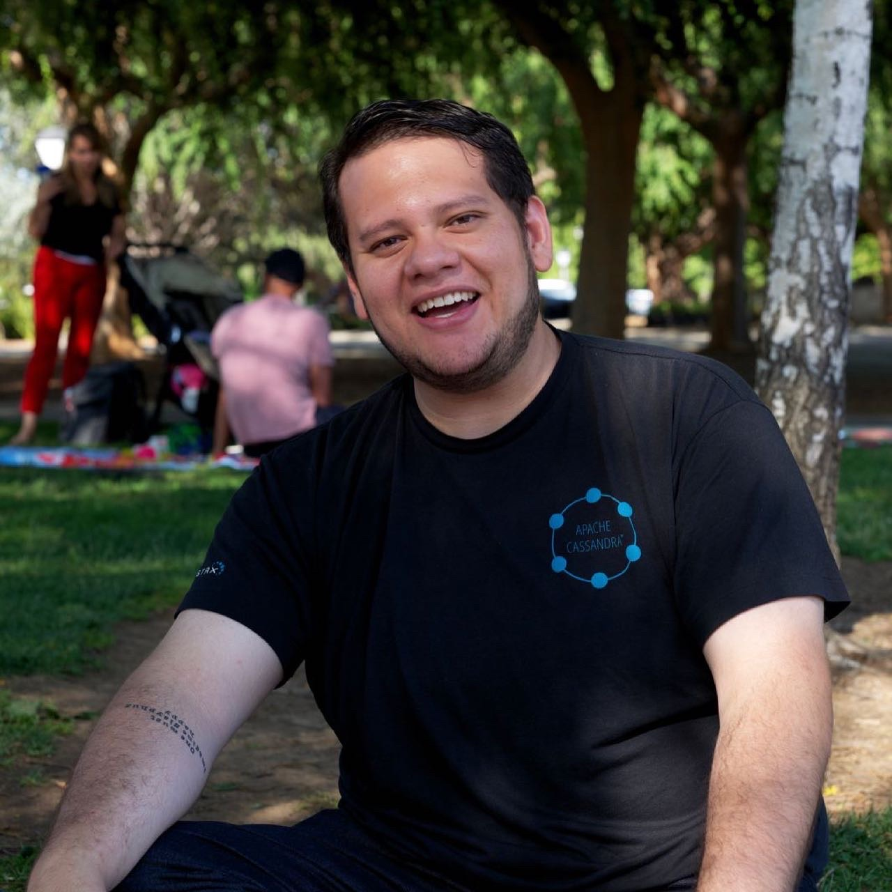

# Lenin Alevski

## Headline

Security Software Engineer | Security+ | Professional Cloud Security Engineer

## Bio

Lenin Alevski Huerta is a Full Stack Engineer and generalist with passion for Information Security, currently an Application Security Engineer and open-source contributor at [MinIO](https://min.io/). Before joining MinIO, Lenin worked at [OneLogin](https://www.onelogin.com/), [Oracle](https://www.oracle.com/mx/index.html) and [Websec Mexico](https://www.websec.mx/) as a software engineer, security consultant and penetration tester. 

Lenin have over 15 years of experience between software development and information security, spending the last 5 years working with containers and cloud technology in projects with Seagate, VMWare, IBM, GM Financial, Scotiabank, and more companies in the US and Latino america.

## Short Bio

Lenin Alevski is a Full Stack Engineer and generalist with passion for Information Security.  Lenin specialize in building and maintaining Distributed Systems, Application Security and Cloud Security in general. Lenin loves to play CTFs and writing about security and privacy on his personal blog [https://www.alevsk.com](https://www.alevsk.com).

## Social

- https://www.linkedin.com/in/alevsk/

- https://twitter.com/alevsk

- https://twitter.com/alevskey

- [Instagram](https://www.instagram.com/alevsk/)
