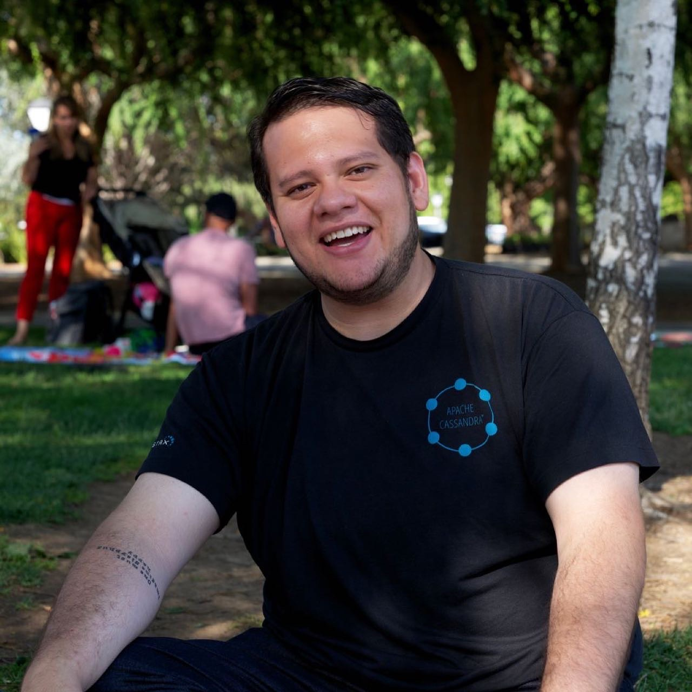

# Lenin Alevski

## Headline

Security Engineer at Google | #RSAC #DEFCON #BSIDES Speaker | Blogger

## Bio

Lenin Alevski is a Security Engineer at [Google](https://www.google.com/) with over a decade of experience in software and security engineering. He specializes in building and defending distributed systems (Kubernetes), currently focused on AI Security and Autonomous Offensive/Defensive capabilities. Lenin works with global organizations on security assurance, ML Red Teaming, and large-scale vulnerability management.

Before joining Google, Lenin worked at [MinIO](https://min.io/), [OneLogin](https://www.onelogin.com/), [Oracle](https://www.oracle.com/mx/index.html), and [Websec Mexico](https://www.websec.mx/) as an appsec engineer, software engineer, security consultant, and penetration tester — working on projects with Seagate, VMware, IBM, GM Financial, Scotiabank, and other companies across the US and Latin America.

Lenin is passionate about building "security that thinks," using agentic frameworks to automate risk management and protect critical AI infrastructure. He loves to play CTFs, contribute to open-source, and write about security and privacy on his personal blog [https://www.alevsk.com](https://www.alevsk.com).

**Areas of expertise:** AI Security (ML Red Teaming & Adversarial Defense), Agentic Frameworks (Autonomous Security), Vulnerability Management at Scale, Kubernetes Hardening, Cloud-Native Security (GCP/AWS/Azure), Distributed Systems, Go, Python, and Applied Cryptography.

## Short Bio

Lenin Alevski is a Security Engineer at [Google](https://www.google.com/) with over a decade of experience in software and security engineering. He specializes in AI Security, Kubernetes hardening, and Cloud-Native security, and is passionate about using agentic frameworks to automate risk management. Lenin loves to play CTFs, contribute to open-source, and write about security and privacy on his personal blog [https://www.alevsk.com](https://www.alevsk.com).

## Social

- [LinkedIn](https://www.linkedin.com/in/alevsk/)

- [Blog](https://www.alevsk.com)

- [@alevsk on X](https://x.com/alevsk)

- [@alevskey on X](https://x.com/alevskey)

- [Instagram](https://www.instagram.com/alevsk/)
